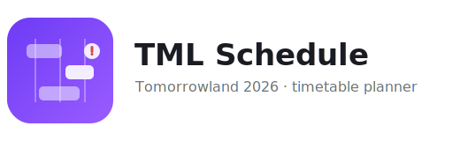

<p align="center">
  
</p>

<p align="center">
  A single-page <strong>festival schedule planner</strong> for the Tomorrowland 2026 lineup (both weekends) —
  plan your sets, spot the clashes, and share your plan with a link. No backend, no account.
</p>

---

## What it does

- **Time × stage grid, one table per festival night** (Fri / Sat / Sun), loaded live from Tomorrowland's lineup CDN.
- **Weekend toggle** — switch between Weekend 1 and Weekend 2; each keeps its own independent lineup.
- **Flip orientation** between Horizontal (time →) and Vertical (time ↓) — the same geometry, axes swapped.
- **Click a set to add it to _My Lineup_** (click again to remove). No modal in the way.
- **Clash detection** — overlapping picks are outlined and counted, but never blocked: keeping conflicting sets is the point.
- **Comments** — add an optional note to any set in your lineup (removing the set removes its note).
- **Sidebar lineup** — your picks grouped by night, with per-set comment/remove, a plan note, and the share link.
- **Shareable via URL** — the whole view (day, orientation, picks, notes) is compressed into the URL hash, so a link restores it exactly. Nothing is stored on a server.
- **Mobile-friendly** — the toolbar collapses to a bottom bar and the lineup becomes a slide-over drawer.

## How the data is interpreted

The source lineup has a few quirks that the app handles deliberately:

- **Festival nights are derived from start timestamps, not the `day`/`date` fields** (both are unreliable in the data — e.g. an after-midnight set is dated the next calendar day, and some sets carry the wrong `day`). A set is grouped into a night by its start time, shifted to the previous night when it starts before 06:00, so a `00:00` set lands at the **end** of the prior night (24:00+) rather than the start of a new day. See [`src/data/lineup.ts`](src/data/lineup.ts) and [`src/lib/time.ts`](src/lib/time.ts).
- **Times are read as the festival's fixed `+02:00` wall clock**, never localized, so the layout is identical in every timezone.
- **Stages render in the festival's published order**, taken from [`src/data/stages.json`](src/data/stages.json).
- **Clashes are detected per night** with a half-open `[start, end)` interval sweep; the rare same-stage overlap is laid out in sub-lanes.
- **Lineup is fetched at runtime** from the CDN (per weekend) — there's no bundled copy. Picks are stored per weekend in the URL, and a pick is dropped automatically if that act disappears from the lineup.

## Tech stack

- [Vite](https://vite.dev) + [React 19](https://react.dev) + **TypeScript** (strict)
- [`lz-string`](https://github.com/pieroxy/lz-string) for compact URL-hash state — the only runtime dependency
- ESLint + Prettier; no test runner or backend by design

## Getting started

```bash
npm install
npm run dev      # start the dev server
```

| Script                                    | What it does                                |
| ----------------------------------------- | ------------------------------------------- |
| `npm run dev`                             | Vite dev server with HMR                    |
| `npm run build`                           | Type-check (`tsc -b`) and bundle to `dist/` |
| `npm run preview`                         | Serve the production build locally          |
| `npm run lint`                            | ESLint                                      |
| `npm run format` / `npm run format:check` | Prettier write / check                      |

## Project structure

```
src/
  data/
    lineup.ts          # fetch CDN JSON + normalize, group into festival nights, stage order, lanes
    useLineup.ts       # React hook: load a weekend, with loading / error / retry
    stages.json        # canonical stage order
  lib/
    time.ts            # timezone-stable minute math
    conflicts.ts       # per-night overlap detection
  state/
    urlState.ts        # ShareState encode/decode (lz-string) + useUrlState hook
  components/
    Timetable.tsx      # the grid (both orientations)
    PerformanceBlock.tsx
    Toolbar.tsx
    Sidebar.tsx        # My Lineup, plan note, share link
    NoteModal.tsx      # optional per-set comment
  App.tsx              # composition
```

## Deployment

The app is fully static with hash-based state, so it deploys to **GitHub Pages** out of the box. A workflow in [`.github/workflows/deploy.yml`](.github/workflows/deploy.yml) builds and publishes `dist/` on every push to `main`; set **Settings → Pages → Source: GitHub Actions** to enable it. The Vite `base` is relative, so it works under a project-pages subpath or a custom domain.
